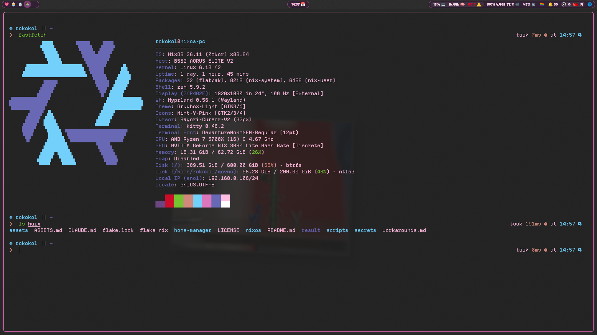
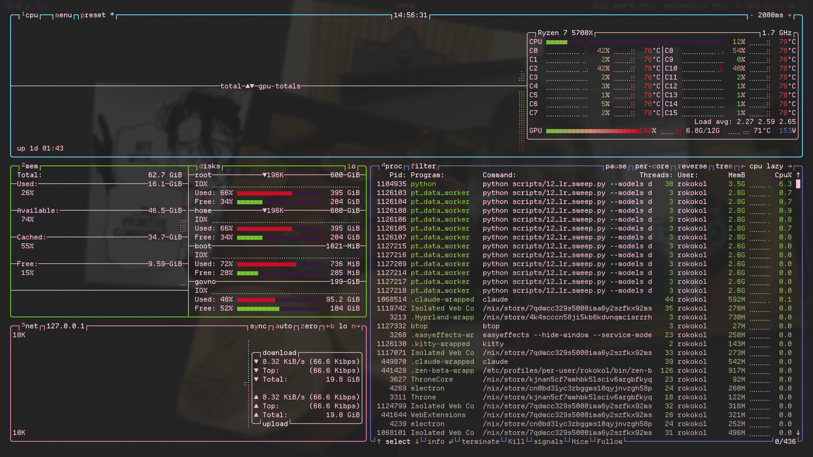

<div align="center">

# ddlc-terminal-themes

**The Doki Doki Literature Club colours for kitty and btop, light and dark** （´ω｀♡%）


[](https://github.com/rokokol/ddlc-palette)
[](LICENSE)
[](https://github.com/rokokol/ddlc-terminal-themes/actions/workflows/build.yml)

</div>

Two terminal themes rendered out of the base16 schemes in [ddlc-palette](https://github.com/rokokol/ddlc-palette), which measures every colour off [ddlc.moe](https://ddlc.moe) rather than eyeballing it. Nothing here is a taste call except which slot goes where

Came over from my rice, **[rokokol/huix](https://github.com/rokokol/huix)**

```sh
# render nothing, install nothing, just look
nix build github:rokokol/ddlc-terminal-themes && cat result/share/ddlc-terminal-themes/ddlc-kitty-dark.conf
```

## Contents

- [What it looks like](#what-it-looks-like)
- [Install](#install)
  - [Home Manager](#home-manager)
  - [Any other distribution](#any-other-distribution)
- [Where the slots go](#where-the-slots-go)
- [Re-rendering](#re-rendering)
- [Tests](#tests)
- [Layout](#layout)
- [License](#license)

## What it looks like




> The wallpaper comes through because kitty runs at `background_opacity 0.9` — neither theme sets an opacity of its own, and btop simply inherits the terminal's

## Install

### Home Manager

```nix
{
  inputs.ddlc-terminal-themes.url = "github:rokokol/ddlc-terminal-themes";

  # in your home configuration
  imports = [ inputs.ddlc-terminal-themes.homeManagerModules.default ];

  ddlc.kitty.enable = true;
  ddlc.btop.enable = true;
}
```

One switch per application, because the two are wired up differently and the wiring is the half that goes wrong:

| option | what it does | default |
| --- | --- | --- |
| `kitty.enable` | the colours into `kitty.conf`, after your own settings — kitty takes the last word for a key | `false` |
| `kitty.variant` | `light` or `dark` | `dark` |
| `btop.enable` | both themes into `~/.config/btop/themes/` and one of them named in `btop.conf` | `false` |
| `btop.variant` | which one is named. The other is deployed anyway — btop lists that directory, so it is a keypress away in its own menu | `dark` |

**Without the module.** `lib.kitty.{light,dark}` and `lib.btop.{light,dark}` are paths, so `readFile` or a `source =` places them yourself; `packages.default` lays the same four files under `share/ddlc-terminal-themes/`

### Any other distribution

```sh
git clone https://github.com/rokokol/ddlc-terminal-themes
cd ddlc-terminal-themes
./install.sh              # --kitty or --btop for one of them
```

Nothing is built: [`dist/`](dist) is committed, so this is a copy into `~/.config`. kitty gets both variants next to `kitty.conf`, where `include ddlc-kitty-dark.conf` resolves; btop lists a theme under its file name, so the app segment is dropped on the way in and `ddlc-btop-dark.theme` lands as `ddlc-dark.theme`

## Where the slots go

kitty follows [tinted-kitty](https://github.com/tinted-theming/tinted-kitty) slot for slot with one departure: that template grounds the selection in `base03`, which leaves `base05` on it at 1.65:1 here, so `base02` carries it instead

btop has no base16 template anywhere upstream, so its mapping is this repository's own:

| group | how it is coloured |
| --- | --- |
| boxes | `cpu_box` blue, `mem_box` green, `net_box` magenta, `proc_box` cyan — four accents, so a glance lands in the right panel |
| load | temperature, CPU and process gradients rise through the palette's warm accents: green, then yellow, then red |
| meters | free, cached, available, used, download and upload carry no scale, so each is one colour with an empty mid and end, which is how btop spells a flat meter |

> [!NOTE]
> The two variants draw different accents, because the palette is polarised — a colour that reads on `ink` is a pastel on `paper`. The [slot table](https://github.com/rokokol/ddlc-palette#as-a-theme) in ddlc-palette says which palette key fills which slot in each

## Re-rendering

`generate.sh` reads the two base16 yamls and writes `dist/`. The devShell puts them in the environment:

```sh
nix develop -c ./generate.sh
./generate.sh --light base16-ddlc-light.yaml --dark base16-ddlc-dark.yaml   # without Nix
```

The schemes come from ddlc-palette and nothing else does — the palette is measured, this repository is only a mapping. A weekly workflow re-renders against the palette's HEAD rather than the lock and opens a pull request when they part ways, so a colour cannot move upstream and quietly leave this dark

## Tests

`nix flake check` proves that `dist/` is what `generate.sh` writes today, that every value in it is a hex colour and the ANSI table is whole, that the module wires both applications up (and touches neither while disabled), and that the two scripts pass shellcheck and shfmt

## Layout

```
generate.sh   the mapping: base16 slots in, two configs per variant out
nix/          module.nix, module-test.nix
dist/         the rendered themes, committed for consumers without Nix
install.sh    for systems without Nix
```

## License

MIT. The colours are Team Salvato's
